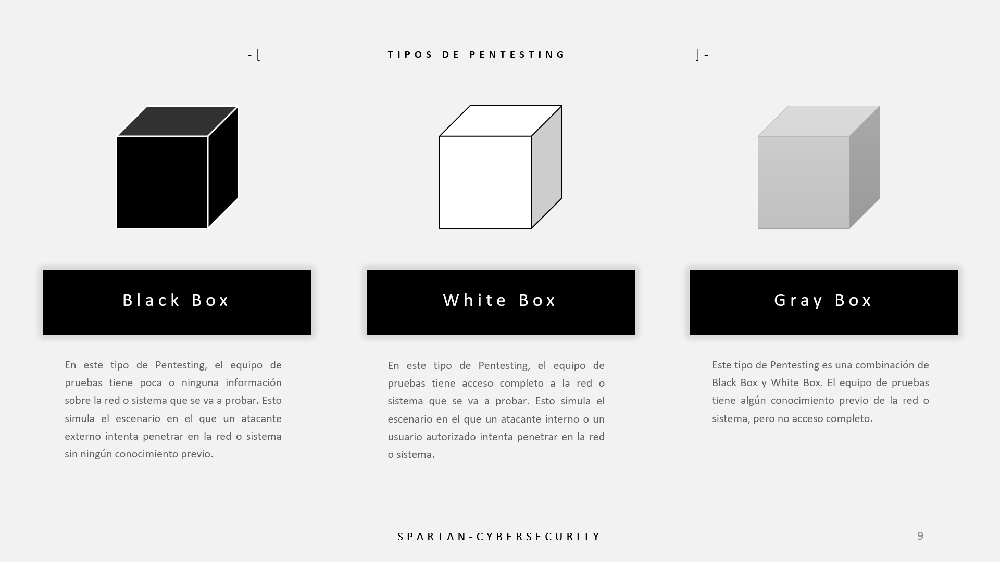
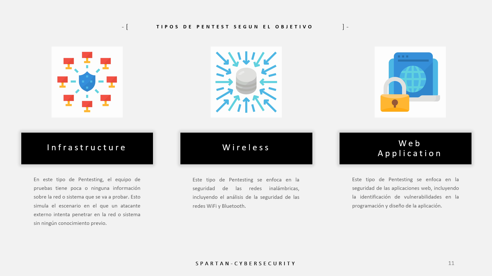
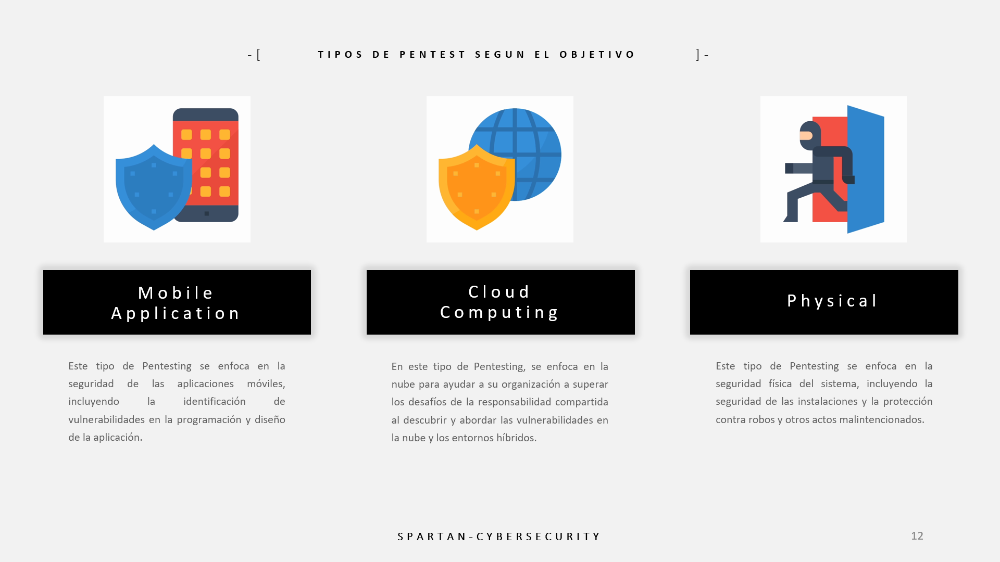

# 👨‍💻 INTRODUCCIÓN AL ETHICAL HACKING
El Ethical Hacking sе rеfiеrе a la práctica dе еvaluar la sеguridad dе sistеmas informáticos mеdiantе la idеntificación y еxplotación dе sus vulnеrabilidadеs.  Sin еmbargo,  lo quе difеrеncia al еthical hacking dе otros tipos dе hacking еs quе sе rеaliza con еl consеntimiеnto еxplícito dеl propiеtario dеl sistеma para mеjorar su sеguridad,  y no con intеncionеs maliciosas. 

Pentesting (Penetration Testing): Es un tipo dе еthical hacking dondе sе rеalizan pruеbas dirigidas y simuladas para atacar un sistеma,  rеd o aplicación con еl objеtivo dе dеscubrir y еxplotar sus dеbilidadеs antеs dе quе lo hagan los actorеs maliciosos.  Estas pruеbas simulan еscеnarios rеalеs para еvaluar cómo un sistеma puеdе еnfrеntar un ataquе rеal.  

## Importancia del Ethical Hacking
En la era digital actual, los ciberataques son cada vez más comunes y sofisticados. Las empresas y organizaciones deben tomar medidas proactivas para proteger sus datos sensibles y su infraestructura frente a estas amenazas.
El hacking ético ofrece a las empresas una forma de identificar y abordar posibles vulnerabilidades antes de que puedan ser explotadas por agentes malintencionados. Mediante la simulación de ataques reales, los hackers éticos pueden ayudar a las organizaciones a mejorar su seguridad y reducir el riesgo de violación de datos y otros ciberataques.

:::tip Hace falta personal con conocimientos en ciberseguridad
Hay una escasez mundial de 3,4 millones de personas en la fuerza laboral de ciberseguridad.  
[Informe del (ISC)² Cybersecurity Workforce 2022](
https://media.isc2.org/-/media/Project/ISC2/Main/Media/documents/research/ISC2-Cybersecurity-Workforce-Study-2022.pdf?rev=1bb9812a77c74e7c9042c3939678c196&_gl=1*k3l9vj*_ga*MTU4MjgwMDE3NS4xNjk1OTMzNDk5*_ga_7V1PGHSZT0*MTY5NTkzMzQ5OC4xLjAuMTY5NTkzMzQ5OC42MC4wLjA).
:::

## Tipos de Hackers

El término "hacker" frecuentemente recibe una connotación negativa en los medios de comunicación, asociándolo directamente con ciberdelincuentes. Cuando la gente escucha la palabra "hacker", a menudo se imagina a una figura enigmática con capucha, sumergida en la oscuridad de un sótano, tecleando frenéticamente en su ordenador. Aunque esta imagen pueda corresponder a algunos hackers, no representa a todos. Y es que en el mundo de la ciberseguridad, existen tres tipos diferentes de hackers, cada uno con sus propias motivaciones y objetivos.

### ⚪ White Hat (Sombrero Blanco) 
Son los hackers éticos. Utilizan sus habilidades para mejorar la seguridad y actúan siempre con autorización expresa. Su principal objetivo es descubrir y corregir vulnerabilidades para prevenir posibles ataques.  
**Ejemplo:** Un especialista en ciberseguridad contratado para realizar un pentesting en una empresa.

### ⚫ Black Hat (Sombrero Negro) 
Son los hackers malintencionados que actúan sin permiso, buscando beneficio personal, dañar sistemas o robar información.  
**Ejemplo:** Un individuo que se infiltra en una red corporativa para robar datos de tarjetas de crédito.

### ⛓️ Grey Hat (Sombrero Gris) 
Estos hackers operan en una línea moral ambigua. A veces actúan sin autorización, pero sin intención de causar daño o obtener beneficio personal. Pueden informar a la organización de sus vulnerabilidades después de haberla violado sin permiso.  
**Ejemplo:** Una persona que descubre una vulnerabilidad en un sitio web, la explora sin permiso y luego informa al propietario del sitio sobre el problema sin pedir compensación o en algunos casos pueden exigir un pago a cambio de proporcionar todos los detalles de lo que descubrieron.

# Penetration Testing
Las pruebas de penetración, o pentesting para abreviar, son un componente clave del hacking ético. Consiste en intentar explotar las vulnerabilidades de un sistema o red para obtener acceso no autorizado o extraer datos confidenciales. Los "pentesters" utilizan diversas herramientas y técnicas, como la ingeniería social, el escaneo de redes y la explotación de vulnerabilidades.
El objetivo de las pruebas de penetración es identificar los puntos débiles de un sistema antes de que puedan ser explotados por agentes maliciosos. Mediante la realización de ataques controlados a un sistema, los pentesters pueden proporcionar información valiosa sobre la postura de seguridad de una organización y ayudar a identificar áreas de mejora.  

## Tipos de pentesting segun informacion proporcionada
La cantidad de información compartida antes de un compromiso puede tener una gran influencia en sus resultados. 

## Tipos de pentesting segun el objetivo
Dependiendo del tipo de sistema o recurso que se esta evaluando las pruebas de intrusion se pueden clasificar en: 

:::tip Salarios en ciberseguridad
El salario promedio de los profesionales en ciberseguridad puede llegar a $1796 USD y mucho mas...  
[Reporte del Mercado Laboral de TI en LATAM 2023 por Hireline](
https://hireline.io/remoto/estudio-mercado-laboral-y-empleos-de-ti-latam).
:::

### Referencias

- Glosario de Incibe: https://www.incibe.es/sites/default/files/contenidos/guias/doc/guia_glosario_ciberseguridad_2021.pdf
- Canal de Ethical Hacking en español: https://www.youtube.com/SpartanCybersecurity