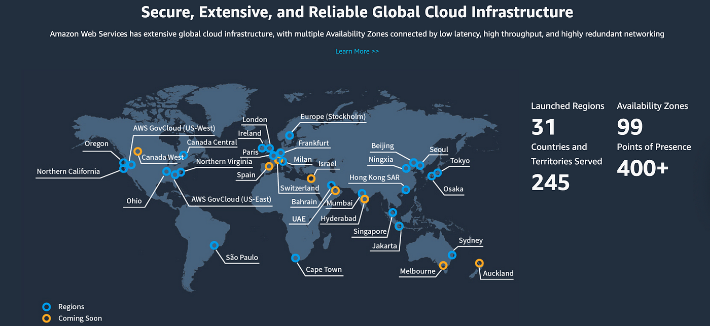
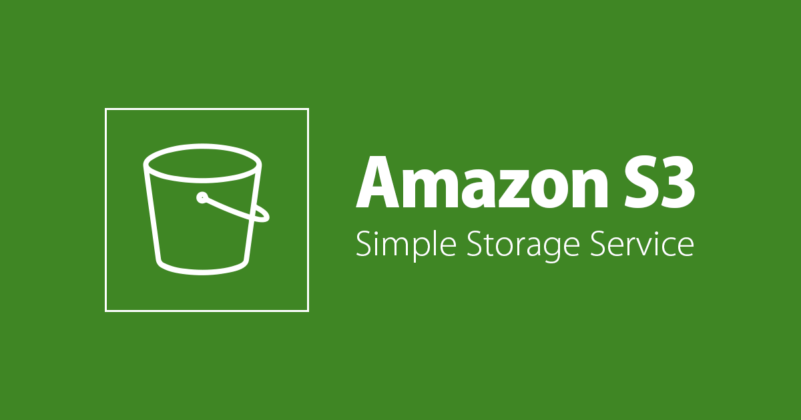
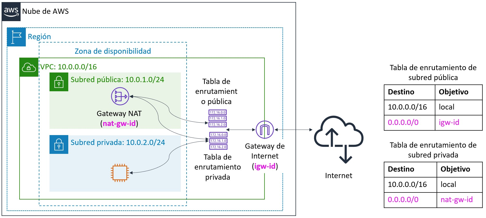
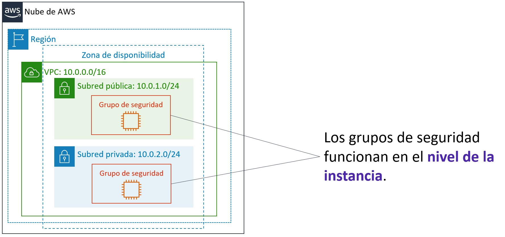
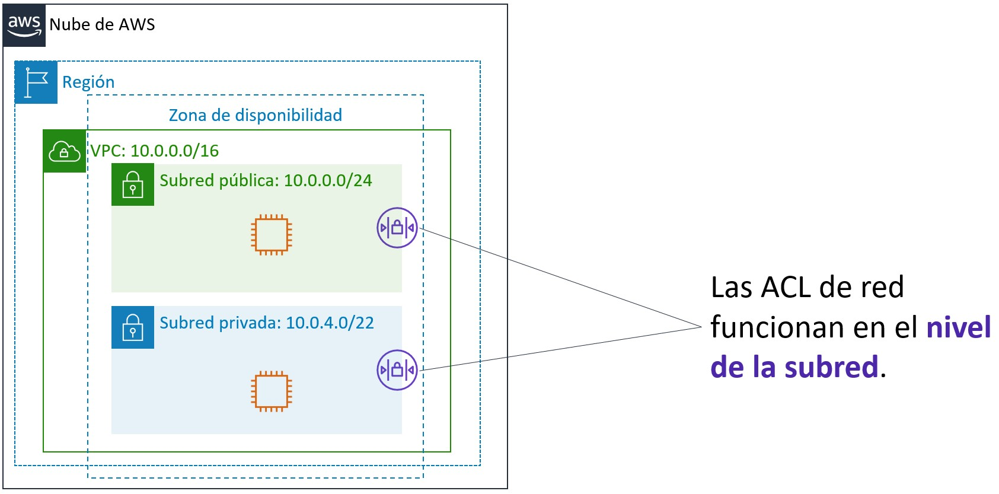

# 🔒 Introducción a Computación en la Nube

# ☁️ Introducción a Amazon Web Services

[Amazon Web Services (AWS)](https://aws.amazon.com/es/what-is-aws/)  es una plataforma en la nube que ofrece un amplio conjunto de productos globales basados en Cloud. Estos productos se entregan a través de Internet, y permiten el acceso bajo demanda a recursos informáticos, de almacenamiento, de red, de base de datos y otros recursos de TI para utilizar en diferentes proyectos, así como las herramientas para administrarlos. A un solo clic se puede aprovisionar y lanzar recursos de AWS. Los recursos estarán listos para que los utilicemos en cuestión de minutos.

AWS ofrece una gran flexibilidad permitiendo realizar nuevas configuraciones y actualizaciones bajo demanda, escalar de forma ascendente o descendente automáticamente para cumplir con los patrones de uso y optimizar el gasto. La facturación de los servicios de AWS se convierte en un gasto operativo en lugar de un gasto de capital.

Los servicios de AWS están diseñados para trabajar en conjunto para poder desarrollar cualquier tipo de aplicación o carga de trabajo.

## Modelo de Precios, Pagos y Soporte en AWS

### Modelo de Precios
AWS tiene tres generadores fundamentales de costos: `cómputo`, `almacenamiento` y `transferencia de datos de salida`. Estas características varían ligeramente en función del producto y el modelo de precios de AWS que elijamos. 

En la mayoría de los casos, no se aplican cargos por la transferencia de datos de entrada ni por la transferencia de datos entre otros servicios de AWS dentro de la misma región de AWS. Existen algunas excepciones, así que asegúrese de verificar las tarifas de transferencia de datos antes de empezar a utilizar el servicio de AWS.

Las transferencias de datos de salida se acumulan entre todos los servicios y, luego, se cobran según la tarifa para ese tipo de transferencia. Este monto aparece en el extracto mensual como AWS Data Transfer Out (Transferencia de datos de salida de AWS). Para más información [Precios](https://aws.amazon.com/es/pricing/)

### ¿Cómo se paga en AWS?

AWS ofrece una gran variedad de servicios en la nube. Solo se paga por la cantidad exacta de recursos que realimente necesitamos. Esta forma de pago se puede sintetizar de la siguiente forma:
* `Pagar por lo que se utliza` - Pagamos solo por los servicios que utilizamos, sin grandes gastos iniciales
* `Pagar menos si se reserva` - Si realizamos reservas de computo, se reduce el precio pudiendo llegar hasta un 75% menos
* `Pagar menos cuanto más se utilice` - Se obtienen descuentos por volumen de utilización de un servicios
* `Pagar aún menos a medida que AWS crece` - Desde 2006, AWS ha bajado los precios 75 veces

Para ayudar a los nuevos clientes de AWS a comenzar a utilizar la nube, AWS ofrece una capa de uso gratuita (la capa gratuita de AWS) durante 1 año como máximo. La capa gratuita de AWS se aplica a determinados servicios y opciones. Para más información https://aws.amazon.com/free

### Soporte en AWS

AWS ofrece 5 planes de soporte

* `Basic` Support ofrece lo siguiente:
    * Acceso al servicio al cliente, a la documentación, a los documentos técnicos y a los foros de soporte las 24 horas, todos los días.
    * Acceso a seis comprobaciones principales de Trusted Advisor.
    * Acceso al panel de estado del servicio.

* `Developer` Support ofrece recursos para clientes que realizan pruebas o tareas de desarrollo iniciales en AWS, así como para clientes que hacen lo siguiente:
    * Acceder a la orientación y al soporte técnico.
    * Exploren cómo poner a AWS en funcionamiento con rapidez.
    * Utilizar AWS para cargas de trabajo o aplicaciones que no sean de producción.

* `Business` Support ofrece recursos a los clientes que ejecutan cargas de trabajo de producción en AWS y a los clientes que hacen lo siguiente:
    * Ejecutar una o más aplicaciones en entornos de producción.
    * Tengan varios servicios activados o realizan un uso intensivo de servicios principales.
    * Depender de que sus soluciones comerciales estén disponibles y sean escalables y seguras.

* `Enterprise On-Ramp` Support ofrece recursos a los clientes que ejecutan cargas de producción o críticas para la empresa en AWS, así como a los clientes que desean lo siguiente:
    * Concentrarse en la administración proactiva para mejorar los niveles de eficiencia y disponibilidad.
    * Crear y utilizar cargas de trabajo que sigan las prácticas recomendadas de AWS.
    * Utilizar los conocimientos de AWS para admitir implementaciones y migraciones.
    * Contar con un grupo de gerentes técnicos de cuentas para proporcionar orientación proactiva y coordinar el acceso a los programas y a los expertos de AWS.

* `Enterprise` Support ofrece recursos a los clientes que ejecutan cargas de trabajo críticas y empresariales en AWS, así como a los clientes que desean lo siguiente:
    * Concentrarse en la administración proactiva para mejorar los niveles de eficiencia y disponibilidad.
    * Crear y utilizar cargas de trabajo que sigan las prácticas recomendadas de AWS.
    * Utilizar los conocimientos de AWS para admitir implementaciones y migraciones.
    * Contar con un director de cuentas técnicas (TAM) que ofrezca experiencia técnica para toda la gama de servicios de AWS y que comprenda en detalle su caso de uso y arquitectura tecnológica. El director de cuentas técnicas es el punto de contacto principal para las necesidades continuas de soporte.

Para más información [Compara los planes de AWS Support](https://aws.amazon.com/es/premiumsupport/plans/?nc=sn&loc=1)

##  Infraestructura Global

La `infraestructura global de AWS` se diseñó y se creó para ofrecer un entorno informático en la nube `flexible, confiable, escalable y seguro` con un rendimiento de red global de alta calidad.

Para más información [Infraestructura Global](https://aws.amazon.com/es/about-aws/global-infrastructure/)

### Regiones en AWS

AWS posee regiones en todo el mundo. Una región es una zona geográfica y es un grupo de centros de datos.
Cada región posee 2 o más zonas de disponibilidad y los datacenter están separados entre ellos con 100 km de distancia en su mayoría (como mínimo 50 km).

Ahora, la gran pregunta es, `¿Cómo elegir una región de AWS?` para responderla debemos evaluar lo siguiente:
* Cumplimiento de los requisitos legales y de gobernanza de datos: los datos nunca salen de una región sin un permiso explícito.
* Proximidad a los clientes: latencia reducida. 
* Servicios disponibles en una región: los nuevos servicios y las nuevas funciones no están disponibles en todas las regiones.
* Precios: los precios varían de una región a otra y son transparentes en la página de precios del servicio.

### Zonas de disponibilidad
Cada `región` cuenta con varias zonas de disponibilidad.
Cada `zona de disponibilida`d es una partición completamente aislada de la infraestructura de AWS.
* Actualmente hay 102 zonas de disponibilidad en todo el mundo.
* Las zonas de disponibilidad constan de centros de datos discretos.
* Están diseñadas para el aislamiento de errores.
* Se interconectan con otras zonas de disponibilidad mediante redes privadas de alta velocidad.
* Podemos eligir que zona de disponibilidad utilizaremos.
* AWS recomienda replicar los datos y recursos entre las zonas de disponibilidad para obtener mayor resiliencia.

### Zonas Locales (Local Zones)

AWS Local Zones es un tipo de implementación de infraestructura que permite tener una muy baja latencia sobre los servicios que se despliegan en ella.

Las Zonas locales dependen de una región (Ej.: la de Argentina depende del Norte de Virginia (us-east-1)) y solo hay algunos servicios de AWS en las local zones, para ver el detalle [Servicios Local Zone](https://aws.amazon.com/es/about-aws/global-infrastructure/localzones/features/?nc=sn&loc=2)

Actualmente en Latinoamérica hay en Lima, Perú - Santiago, Chile - Buenos Aires, Argentina ... Proximamente Bogotá, Colombia ... más información [Zonas Locales](https://aws.amazon.com/es/about-aws/global-infrastructure/localzones/locations/?nc=sn&loc=3&refid=fc81dabe-57e1-4c46-8d33-cfd3acf1ef08)

## Servicios Infomática (Compute Services) en AWS

AWS brinda una gran variedad de servicios informáticos para satisfacer las necesidades de las organizaciones, como Amazon Elastic Compute Cloud (EC2), Amazon Elastic Container Service (ECS), Amazon Elastic Container Service for Kubernetes (EKS), Amazon Lightsail, AWS Batch y AWS Lambda, por nombrar algunos. Para algunos servicios como Amazon EC2, se contratan con modalidad IaaS, mientras que para otros, como Lambdas son de tipo SaaS.

Para más información sobre los servicios de informática, podes ir a 
 [Informática - Compute](https://aws.amazon.com/es/products/compute/)

### Elastic Compute Cloud - EC2

La sigla EC2 en Amazon significa `Elastic Compute Cloud`:
* `Elastic` se refiere a la capacidad para aumentar o reducir fácilmente la cantidad de servidores que se ejecutan para admitir una aplicación de manera automática, así como para aumentar o reducir el tamaño de los servidores existentes.
* `Compute` hace referencia al motivo principal por el que la mayoría de los usuarios ejecutan servidores: poner aplicaciones en ejecución o procesar data. Estas acciones requieren recursos informáticos, incluida la capacidad de procesamiento (CPU) y la memoria (RAM). 
* `Cloud` se refiere al hecho de que las instancias EC2 ejecutadas se alojan en la nube. 

`Amazon EC2` brinda máquinas virtuales en la nube y ofrece la gestión sobre el sistema operativo Windows o Linux que se ejecuta en la instancia. Es compatible con la mayoría de los sistemas operativos de servidores, incluidos Windows 2012, 2016, 2019 y 2022; Red Hat; SuSE; Ubuntu; y Amazon Linux.

Un sistema operativo que se ejecuta en una máquina virtual suele denominarse sistema operativo invitado para distinguirlo del sistema operativo host. El sistema operativo host se instala directamente en un hardware que aloja una o más máquinas virtuales.

Con `Amazon EC2`, podemos lanzar cualquier cantidad de instancias de todo tipo de tamaños en cualquier zona de disponibilidad y local zone del mundo y lograrlo en cuestión de minutos. Las instancias se lanzan a partir de `imágenes de Amazon Machine (AMI)`, que son plantillas de máquinas virtuales. 

Podemos controlar el tráfico desde y hacia las instancias a través de los grupos de seguridad.

Para más información [EC2](https://aws.amazon.com/es/ec2/)

### Grupo de Auto escalado EC2 - EC2 Auto Scalling Groups

`Auto Scaling Groups` ayuda a mantener la disponibilidad de las aplicaciones y 
 permite agregar o eliminar instancias EC2 de forma automática según las políticas definidas y las comprobaciones de estados. Cuando especificamos las políticas de escalado, el `Auto Scaling Group` puede lanzar o terminar instancias en función del aumento o la disminución de la demanda de la aplicación. 

`Auto Scaling Group` se integra a Elastic Load Balancing: registra automáticamente nuevas instancias al balanceador de carga para distribuir el tráfico entrante entre las instancias. 

Los `Auto Scaling Group` permiten crear arquitecturas de alta disponibilidad que abarcan varias zonas de disponibilidad en una región. Si una zona de disponibilidad pasa a estar en mal estado o no está disponible, `Auto Scaling Group` lanza nuevas instancias en una zona de disponibilidad que no se haya visto afectada. Cuando la zona de disponibilidad en mal estado vuelve a tener un estado correcto, `Auto Scaling Group` redistribuye automáticamente las instancias de la aplicación de manera uniforme entre todas las zonas de disponibilidad designadas. 

Para más información [Auto Scaling Groups](https://docs.aws.amazon.com/autoscaling/ec2/userguide/index.html)

### AWS Lambda

AWS ofrece muchas opciones de informática. Por ejemplo, Amazon EC2 brinda máquinas virtuales. Otro ejemplo, Amazon ECS y Amazon EKS son servicios de informática basados en contenedores.

Sin embargo, también existe otro enfoque para la informática que no requiere que aprovisionemos o administremos ningún servidor. Este tercer enfoque se conoce a menudo como informática sin servidor. 

AWS Lambda es un servicio de informática sin servidor basado en eventos. Este servicio permite ejecutar código sin disponibilizar ni administrar servidores. 

Se puede crear una función de Lambda, que es el recurso de AWS que contiene el código que subimos. Luego, configuramos la función Lambda que se debe desencadenar, ya sea en forma programada o como respuesta a un evento. El código solo se ejecuta cuando se desencadena.

Se paga por el tiempo que utilicemos los recursos informáticos y no se cobrará nada cuando el código no se ejecute.

Para más información [Lambda](https://aws.amazon.com/es/lambda/)

## Servicios de Almacenamiento en AWS

Los servicios de almacenamiento en AWS (Storage Services) permiten el almacenamiento de los datos tanto a nivel de bloque como de objetos. A continuación veremos los más relevantes

Para más información [Almacenamiento](https://aws.amazon.com/es/products/storage/)

### Amazon Simple Storage Service (S3) - Buckets de S3

`Amazon S3` es una solución administrada de almacenamiento en la nube que se diseñó para brindar un escalado sin problemas y 99,999999999 % (11 nueves) de durabilidad. Además de poder almacenar prácticamente todos los objetos dentro de un bucket, 
 permite realizar operaciones de escritura, lectura y eliminación de los objetos almacenados en el bucket. Los `nombres de los buckets son universales` y deben ser únicos entre todos los nombres de buckets existentes en Amazon S3. Los objetos pueden ser de hasta 5 TB. De forma predeterminada, en Amazon S3 los datos se almacenan de forma redundante en varias instalaciones y en diferentes dispositivos.

Los datos que almacenamos en Amazon S3 no están asociados a ningún servidor en particular. Además, no necesita administrar ninguna infraestructura. Podemos colocar tantos objetos como desiemos en S3. S3 contiene billones de objetos y, con regularidad, tiene picos de millones de solicitudes por segundo. 

Los objetos pueden ser prácticamente cualquier archivo de datos, como imágenes, videos o logs de servidores. Como S3 admite objetos de hasta varios terabytes de tamaño, permite almacenar instantáneas de bases de datos como objetos. S3 ofrece acceso de baja latencia a los datos a través de Internet mediante HTTP o HTTPS, para que poder recuperar datos en cualquier momento y desde cualquier lugar. También podemos acceder a S3 de forma privada a través de un punto de enlace en el VPC. 

De forma predeterminada, no se comparte ninguno de sus datos públicamente. También podemos cifrar los datos en tránsito y se habilita el cifrado del lado del servidor en sus objetos por defecto.

Podemos acceder al bucket de S3 a través de la consola de administración de AWS, de forma programática a través de la API y los SDK, o con soluciones de terceros que utilizan la API o los SDK de AWS.

Para más información [S3](https://aws.amazon.com/es/s3/)

### Amazon EBS (Elastic Block Storage) - Almacenamiento de Bloque elástico

`Amazon EBS` permite crear volúmenes de almacenamiento individuales y asociarlos a una instancia EC2. Amazon EBS ofrece `almacenamiento a nivel de bloques`, en el cual los  volúmenes se replican automáticamente dentro de su zona de disponibilidad. 

`Amazon EBS` está diseñado para proporcionar almacenamiento a nivel de bloques duradero y desmontable (que es como un unidad de disco externo) para instancias EC2. Como se encuentran asociados de forma directa a las instancias, podemos proporcionar baja latencia entre la ubicación en la que están guardados los datos y en la que se ejecuta la instancia.  

Una `copia de seguridad` de un volumen de EBS se denomina `instantánea` (snapshot). La primera instantánea se denomina instantánea de referencia. Cualquier otra instantánea posterior a la de referencia captura solo lo que es diferente de la instantánea anterior (el diferencial). 

Entre los usos de los volúmenes de EBS, se incluyen los siguientes: 
* Volúmenes de arranque y almacenamiento para instancias de EC2
* Almacenamiento de datos con un sistema de archivos determinado
* Bases de Datos
* Aplicaciones 

Para más información [EBS](https://aws.amazon.com/es/ebs/)

### EFS

Amazon EFS es un servicio completamente administrado que facilita la configuración y el escalado del almacenamiento de archivos en la nube de AWS. Puede utilizar Amazon EFS para crear un sistema de archivos para big data y análisis, flujos de trabajo de procesamiento multimedia, administración de contenido, servidores web y directorios principales. 

Puede crear sistemas de archivos que sean accesibles para las instancias de Amazon EC2 a través de una interfaz de sistema de archivos (mediante las API estándares de operaciones de E/S de archivos del sistema operativo). Estos sistemas de archivos admiten semántica de acceso completo al sistema de archivos, como la consistencia sólida y el bloqueo de archivos.

Los sistemas de archivos de Amazon EFS pueden escalar automáticamente desde gigabytes hasta petabytes de datos sin necesidad de aprovisionar almacenamiento. Miles de instancias de Amazon EC2 pueden acceder al mismo tiempo a un sistema de archivos de Amazon EFS. Este servicio, además, está diseñado para proporcionar un rendimiento uniforme a cada una de estas instancias. Amazon EFS también está diseñado para ofrecer alta disponibilidad y larga duración. Con Amazon EFS, no hay tarifas mínimas ni costos de configuración; solo paga por el almacenamiento que utiliza.

Para más información [EFS](https://aws.amazon.com/es/efs/)

## Servicios de Redes / Networking en AWS

Estos servicios permiten la definición de redes y la conectivadad dentro de AWS. También permiten la conectividad con redes On-Premise u otras nubes.

### Amazon Virtual Private Cloud - Amazon VPC

`Amazon Virtual Private Cloud (Amazon VPC)` es un servicio que permite desplegar una sección de la nube de AWS aislada lógicamente (denominada nube virtual privada o VPC) donde podemos lanzar sus recursos de AWS.

Amazon VPC permite controlar los recursos de red virtual, incluye la selección del direcciones IP de la red, la creación de subredes y la configuración de tablas de enrutamiento y gateways de red. Se pueden utilizar protocolos IPv4 e IPv6 para acceder de forma segura a los recursos y las aplicaciones.

También permite personalizar la configuración de red del VPC. Por ejemplo, podemos crear una subred pública para los servidores web que tengan acceso a Internet de forma pública. También podemos implementar una subred privada para sistemas de backend (como los servidores de aplicaciones o de bases de datos) sin acceso a Internet.

### Subredes

Después de crear una VPC, puede dividirla en una o más subredes. Una subred es un intervalo de direcciones IP en una VPC. Las subredes pertenecen a una única zona de disponibilidad. Puede crear subredes en diferentes zonas de disponibilidad para conseguir un nivel elevado de disponibilidad. En general, las subredes se clasifican como públicas o privadas. Las subredes públicas tienen acceso directo a Internet, pero las subredes privadas, no.

### Internet Gateway - Gateway de Internet

Un Internet gateway es un componente del VPC escalable, redundante y altamente disponible que permite la comunicación entre instancias en el VPC e Internet. 
El Internet gateway se configura a nivel regional y se configura 1 para todo el VPC. 

Para hacer pública una subred, debemos asociar una Internet Gateway al VPC y agregar una ruta en la tabla de enrutamiento para enviar el tráfico que no es local a Internet (0.0.0.0/0) a través del Internet gateway. 

### NAT Gateway - Gateway de traducción de las direcciones de red (NAT)
 
Un NAT Gateway permite a las instancias de la/s subred/es privada/s conectarse a Internet o a otros servicios de AWS, a la vez que impide a Internet iniciar una conexión con esas mismas instancias. 

Para crear un NAT Gateway, debemos especificar la subred pública en la que se debe ubicar la NAT Gateway. También debemos especificar una dirección IP elástica para asociar a la NAT Gateway cuando lo creamos (se puede crear en el momento de creación también). Una vez creado el NAT Gateway, debemos actualizar la tabla de enrutamiento que esté asociada a una o más de las subredes privadas para que dirija el tráfico orientado hacia Internet a través del NAT Gateway. De esta manera, las instancias con subredes privadas podrán comunicarse hacia Internet. 

### Grupos de Seguridad / Security Group

Un Grupo de Seguridad (Security Group) funciona como un firewall virtual de la instancia para controlar el tráfico de entrada y salida. Los grupos de seguridad actúan al nivel de las instancias, pero no en la subred. Por lo tanto, cada instancia en una subred de un VPC puede  tener asignado más de un grupo de seguridad diferente.

Basicamente, un grupo de seguridad representa una forma de filtrar el tráfico hacia las instancias.

### NACL - Network ACL - Lista de Control de Acceso a la red

Una lista de control de acceso a la red (Network ACL) es una capa de seguridad opcional en el VPC. Actúa como firewall para controlar el tráfico que entra y sale de una o más subredes. Para agregar una capa de seguridad adicional al VPC, podemos configurar Network ACL con reglas similares a los grupos de seguridad.

Cada subred en el VPC debe estar asociada a una Network ACL. Si no asociamos una subred de forma explícita a una Network ACL, la subred se asociará automáticamente a la Network ACL predeterminada. Podemos asociar una Network ACL a varias subredes; sin embargo, una subred solo se puede asociar a una Network ACL a la vez. Cuando se asocia una Network ACL a una subred, se elimina la asociación anterior. 

### ELB

## Servicios de Integración de Aplicaciones

### SQS

### SNS 

### Step Functions

### EventBridge

## Servicios de Bases de Datos

Los Servicios de Bases de datos son aquellos que brindan la posibilidad de acceder, almacenar y actualizar datos de la forma que las diferentes aplicaciones lo necesitan.

Podemos utilizar los siguientes tipos de bases de datos:

* `Relacional` (Amazon Aurora, Amazon RDS, Amazon Redshift)
* `Clave-valor` (Amazon DynamoDB)
* `En memoria` (Amazon ElasticCache, Amazon MemoryDB for Redis)
* `Documento` (Amazon DocumentDB)
* `Columna ancha` (Amazon Keyspaces)
* `Grafos` (Amazon Neptune)
* `Series` Temporales (Amazon Timestream)
* `Contabilidad-Blockchain` (Amazon Quantum Ledger Database Services)

Para más información [Bases de Datos](https://aws.amazon.com/es/products/databases/)

### Amazon RDS - Amazon Relational Database Service - Servicio de Bases de Datos Relacionales

`Amazon RDS` es un servicio administrado que permite configurar y operar una base de datos relacional en AWS. 

`Amazon RDS` permite centrarse en las aplicaciones para poder proporcionarles rendimiento, alta disponibilidad, seguridad y compatibilidad necesarias. Con este servicio, podemos enfocarnos principalmente en los datos y en optimizar la aplicación. 

Las instancias y el almacenamiento de base de datos difieren en cuanto a las características de rendimiento y el precio, permitiendo adaptar el costo y el rendimiento a las necesidades de la base de datos. Cuando eligimos crear una instancia de base de datos, primero tenemos que especificar qué motor de base de datos vamos a ejecutar. Actualmente, Amazon RDS admite seis motores bases de datos relacionales: 
* MySQL
* Amazon Aurora
* Microsoft SQL Server
* PostgreSQL
* MariaDB
* Oracle

Para más información [RDS](https://aws.amazon.com/es/rds/)

### Amazon Aurora

`Amazon Aurora` es una base de datos relacional compatible con MySQL y PostgreSQL que se fue creada por AWS. Combina el rendimiento y la disponibilidad de las bases de datos comerciales de alta gama con la simplicidad y la rentabilidad de las bases de datos de código abierto. 

El uso de `Amazon Aurora` permite reducir los costos de la base de datos y, al mismo tiempo, mejorar la fiabilidad y disponibilidad de la base de datos. 

Aurora está diseñado para automatizar tareas cuya realización requieren mucho tiempo, como el aprovisionamiento, la implementación de parches, la realización de copias de seguridad, la recuperación, la detección de errores y la reparación.

Existen versiones Serverless de `Amazon Aurora` permitiendo disponilibilizar únicamente por lo que se va a utilizar. También permite Green/Blue deployment de nuevas versiones del motor de base de datos.

Para más información [Aurora](https://aws.amazon.com/es/rds/aurora/)

### DynamoDB

`DynamoDB` es un servicio de base de datos NoSQL rápido y flexible para todo tipo de aplicaciones que requieren una latencia uniforme de milisegundos a escala. 

Amazon administra toda la infraestructura subyacente de datos para este servicio y almacena los datos de manera redundante en varias zonas dentro de una región como parte de la arquitectura tolerante a errores. Con `DynamoDB`, podemos crear tablas y elementos. Podemos agregar elementos a una tabla. El sistema particiona los datos automáticamente y cuenta con el almacenamiento de tablas necesario para cumplir con los requisitos de carga de trabajo. No existe ningún límite práctico respecto de la cantidad de elementos que se pueden almacenar en una tabla. 

Uno de los beneficios de las `bases de datos NoSQL` es que los elementos de la misma tabla pueden tener atributos diferentes. Esto brinda flexibilidad para agregar atributos a medida que la aplicación evoluciona. Podemos almacenar elementos con formatos más nuevos junto a otros con formatos más viejos en la misma tabla, sin tener que realizar migraciones de esquemas.

El almacenamiento puede crecer según las necesidades de la aplicación. Todos los datos de `DynamoDB` se almacenan en unidades de estado sólido (SSD), y su lenguaje de consulta simple permite un rendimiento de las consultas uniforme y baja latencia. DynamoDB permite aprovisionar el rendimiento de lectura o escritura que necesita para cada tabla. A medida que aumenta la cantidad de usuarios en una aplicación, las tablas de `DynamoDB` se pueden escalar para admitir el incremento de las solicitudes de lectura y escritura mediante el aprovisionamiento manual. Pudiendo también 
 habilitar el escalado automático para que `DynamoDB` monitoree la carga de la tabla e incremente o disminuya el rendimiento aprovisionado de manera automática. 

La posibilidad de crear `tablas globales` permite generar réplicas de manera automática en las regiones de AWS que elijamos, el cifrado en reposo y la visibilidad del tiempo de vida (TTL) de los elementos. 

Para más información [DynamoDB](https://aws.amazon.com/es/dynamodb/)

## Servicios de Monitoreo y Alarmas
Los servicios de Monitoreo y Alarmas en AWS son los que permite poseer métricas de los servicios de AWS (Cloudwatch Metrics, X-Ray) como también tener archivos de registro (CloudWatch Logs).

También permite la creación de Alarmas basados en las métricas y registros definiendo humbrales (CloudWatch Alarms)

### CloudWatch Metrics

Amazon `CloudWatch Metrics`, recopila y procesa los datos sin formato de diferentes servicios de AWS, y los convierte en métricas legibles casi en tiempo real. Estas estadísticas se registran durante un periodo de 15 meses, de forma que podamos acceder a la información histórica y obtener una mejor perspectiva acerca del rendimiento de los servicio y/o aplicación web.

De forma predeterminada, el monitoreo básico, envía datos de métricas a CloudWatch en intervalos de 5 minutos. Para enviar los datos de las métricas a CloudWatch cada 1 minuto, podemos habilitar el monitoreo detallado según el servicio. 

Asimismo, Amazon Cloudwatch permite crear "nuevas métricas" instalando el agente de Cloudwatch en las instancias de EC2 (por ejemplo para el monitoreo de la memoria RAM).
### CloudWatch Alarms

Las `CloudWatch Alarms` se utilizan para inicializar una acción con respecto a un valor. Una alarma controla una métrica a lo largo de un periodo de tiempo especifico y realiza una o varias acciones en función del valor de la métrica verificando un umbral a lo largo del tiempo.

La acción más común es enviar una notificación a un topico de SNS o a una política de Auto Scaling. 

Las alarmas de CloudWatch no invocan acciones simplemente porque se encuentren en un estado determinado. El estado debe haber cambiado y haberse mantenido durante un número determinado de periodos.

### CloudWath Logs

Amazon `CloudWatch Logs` permite monitorear y registrar los problemas nuestros sistemas y aplicaciones mediante archivos de log personalizados, de aplicación y de 
 sistemas existentes.

Podemos utilizar Amazon CloudWatch Logs para monitorearr, almacenar y agrupar archivos de log enviados por instancias de EC2, CloudTrail, Route 53 y otras fuentes.

Los registros de CloudTrail pueden enviarse a CloudWatch Logs para ser monitoreados 
 en tiempo real.

`CloudWatch Logs` permite realizar filtros de métricas para analizar los datos de registro que genera una métrica de CloudWatch.

## Buenas prácticas Cloud en AWS

### CAF

### Well Architecture Framework